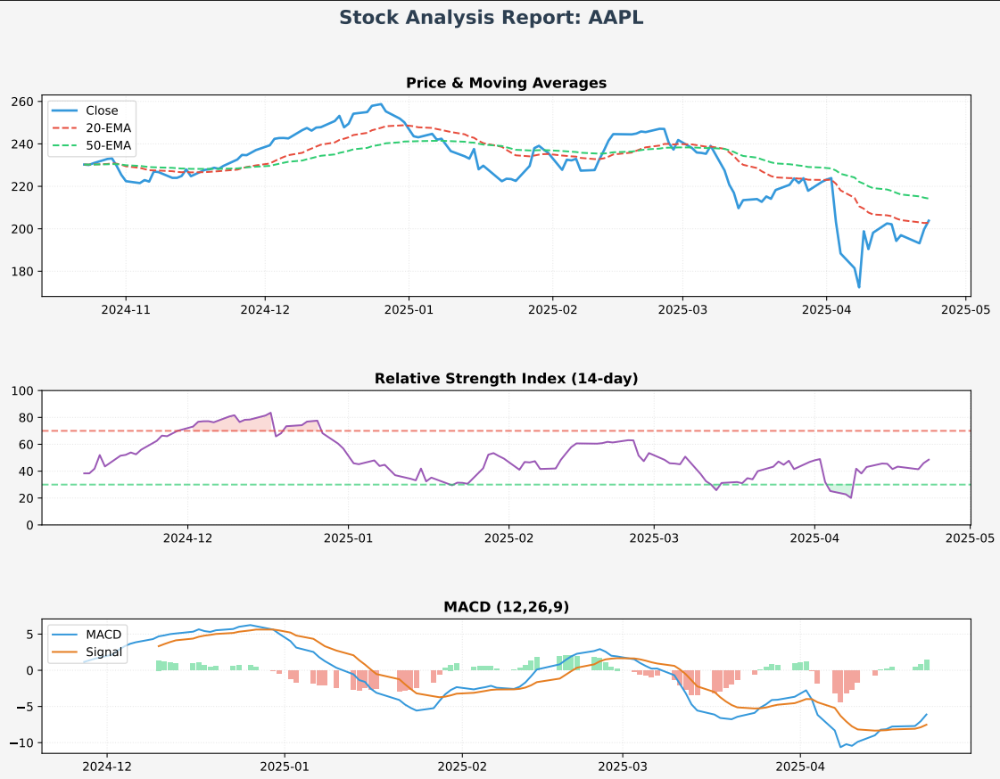
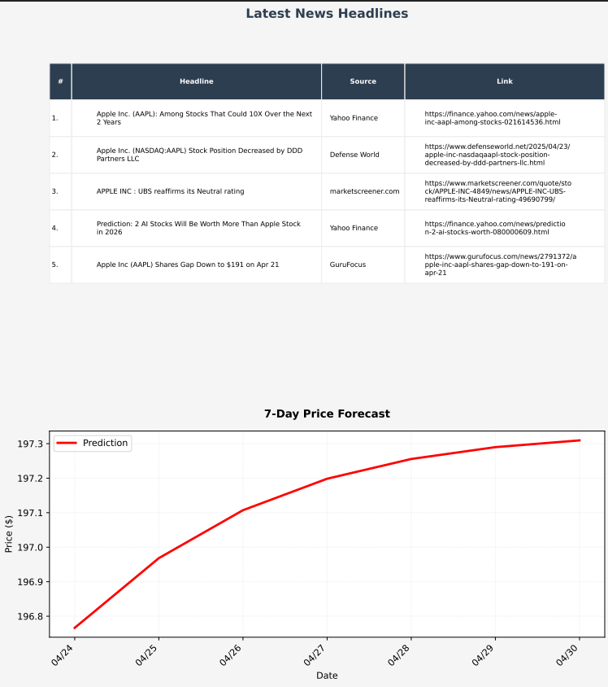

# Stock Report Automation and Predictive Testing

This project automates the generation of stock market reports and implements predictive testing strategies to forecast future stock performance.

## Overview

This system aims to streamline the process of analyzing stock data by automatically fetching relevant information, generating comprehensive reports, and applying predictive models to identify potential investment opportunities or risks.

## Features

* **Automated Data Retrieval:** Fetches real-time or historical stock data from reliable sources (Yahoo Finance).
* **Report Generation:** Automatically creates reports containing key stock metrics, visualizations such as charts of price trends, trading volume, and statistical analysis.
* **Predictive Testing:** Implements Long Short Term Memory network to forecast future stock prices or trends.
* **Model Evaluation:** Includes methods to evaluate the performance and accuracy of the predictive models.
* **Customizable Parameters:** Allows users to specify the stocks to analyze, the timeframes for data, and the predictive models to use.

## Sample output 
### AAPL Stocks :




## Prerequisites

Before running the project, ensure you have the following installed:

* **Python 3.x**
* **pip** (Python package installer)

You will also need to install the necessary Python libraries. It's recommended to create a `requirements.txt` file listing all dependencies. Here are some common libraries you might use:

```bash
pip install pandas numpy matplotlib scikit-learn yfinance # Example libraries, adjust as needed
